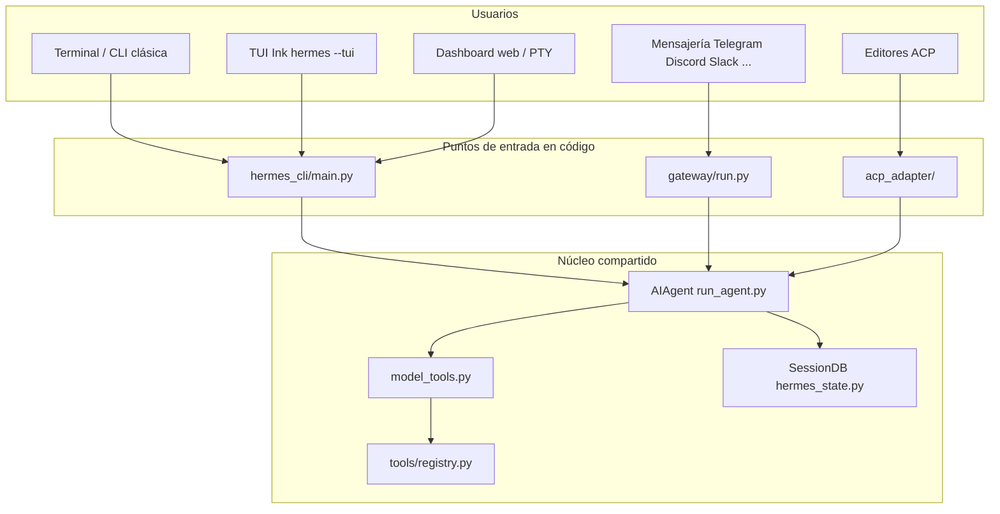
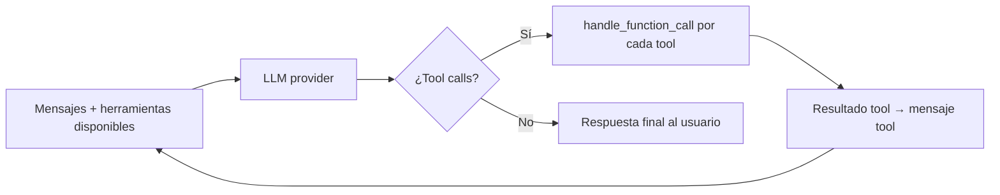
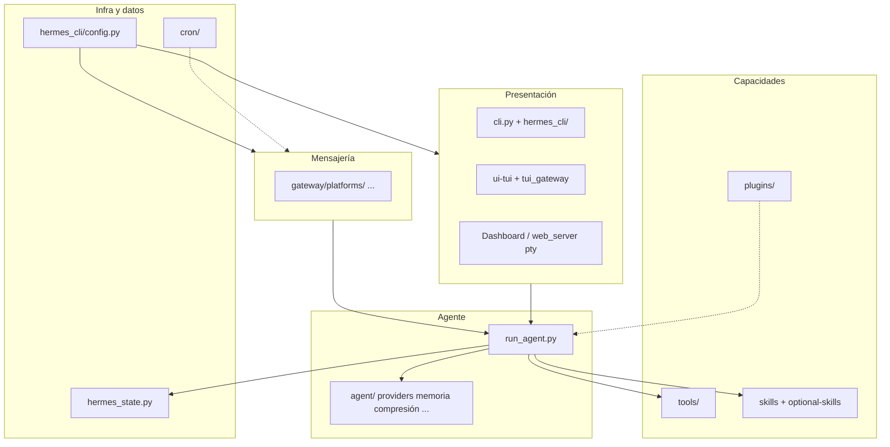
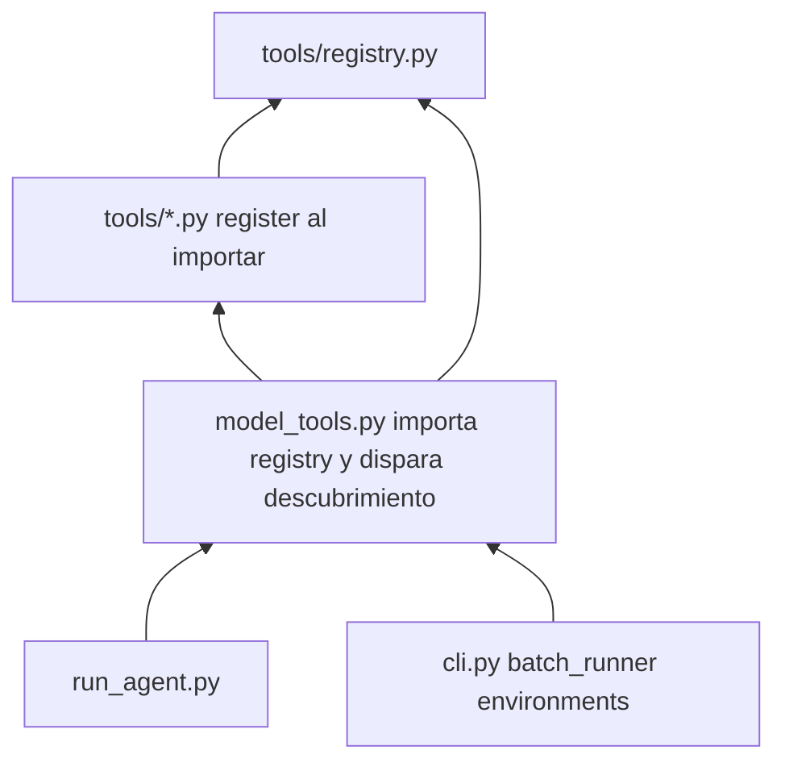
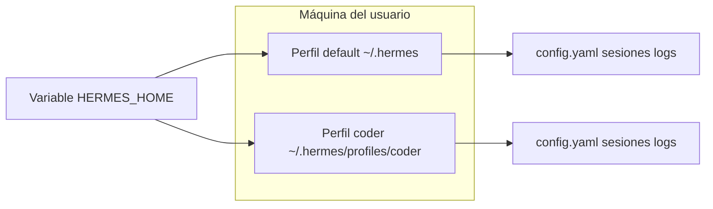

# Hermes Agent — visión de alto nivel del proyecto

Este documento resume **qué es** el repositorio, **cómo encajan las piezas** y **cómo fluye el trabajo** del asistente. Está pensado para lectores **no técnicos** (producto, operaciones, negocio) y **técnicos** (ingeniería, DevOps, integración).

---

## Para personas no técnicas

**Hermes Agent** es un asistente de inteligencia artificial que puedes usar **desde la terminal de tu ordenador** o **desde aplicaciones de mensajería** (Telegram, Discord, Slack, WhatsApp, etc.). No depende de un único proveedor de modelos: puedes conectar distintos servicios de IA según tu presupuesto y necesidades.

En la práctica:

1. **Escribes o hablas** con el asistente (pregunta, tarea, instrucción).
2. El sistema **elige respuestas** usando un modelo de lenguaje y, cuando hace falta, **usa herramientas**: leer archivos, ejecutar comandos en un entorno controlado, buscar en la web, recordar contexto de sesiones anteriores, etc.
3. **Guarda conversaciones y configuración** de forma local (en tu perfil de usuario), con opciones de memoria a largo plazo y automatización (por ejemplo tareas programadas).

**Metáfora:** imagina un **analista senior** que tiene acceso a un **cuarto de herramientas** (terminal, búsqueda, calendario, integraciones) y a un **archivo de notas** (sesiones y memoria). Tú le das objetivos; él razona, actúa con herramientas cuando procede y te devuelve resultados en el mismo canal donde escribiste.

---

## Para personas técnicas

- **Lenguaje principal:** Python 3.
- **Núcleo del agente:** `run_agent.py` — clase `AIAgent`, bucle conversacional síncrono con llamadas tipo OpenAI Chat Completions, **tool calling**, presupuestos de iteración e interrupciones.
- **Orquestación de herramientas:** `model_tools.py` — descubrimiento de herramientas, `handle_function_call()`, plugins.
- **Definición de toolsets:** `toolsets.py` — conjuntos de herramientas habilitables por plataforma o política.
- **CLI clásica:** `cli.py` — Rich + prompt_toolkit; **TUI Ink:** `ui-tui/` + backend JSON-RPC `tui_gateway/`.
- **Mensajería:** `gateway/` — proceso que adapta Telegram, Discord, Slack, etc., a la misma lógica de sesión y agente.
- **Persistencia de sesiones:** `hermes_state.py` (SQLite, búsqueda FTS5).
- **Configuración y rutas por perfil:** `hermes_cli/config.py`, `hermes_constants.py` (`HERMES_HOME`, perfiles aislados).
- **Herramientas:** `tools/*.py` registradas vía `tools/registry.py` (importación en cadena desde `model_tools`).

La documentación oficial del producto vive en [hermes-agent.nousresearch.com/docs](https://hermes-agent.nousresearch.com/docs/).

---

## Diagrama 1 — Dónde vive Hermes (canales de entrada)

Vista simplificada: el **mismo cerebro del agente** puede atenderte por varias “puertas”.

**Lectura rápida:** los usuarios llegan por CLI, TUI, gateway o integraciones; todas convergen en `AIAgent` y en el mismo sistema de herramientas y sesiones.

---

## Diagrama 2 — Bucle conversacional (alto nivel)

El agente no es solo “una respuesta”: es un **bucle** que puede invocar herramientas varias veces hasta terminar el turno o agotar presupuesto.

**Nota de diseño:** el formato de mensajes sigue el estilo OpenAI (`system` / `user` / `assistant` / `tool`). El contenido de razonamiento puede almacenarse en el mensaje del asistente según el proveedor.

---

## Diagrama 3 — Capas del repositorio (mapa mental)

Útil para orientarse en el árbol de carpetas sin listar cada archivo.

---

## Diagrama 4 — Cadena de descubrimiento de herramientas

Tomada de la guía interna del proyecto: **quién importa a quién** afecta al orden de registro y disponibilidad de tools.

Si el código lee el estado de plugins **sin** haber importado antes `model_tools`, puede ser necesario llamar explícitamente a `discover_plugins()` (comportamiento documentado en `AGENTS.md`).

---

## Diagrama 5 — Perfiles (`HERMES_HOME`)

Varias “instancias” aisladas (configuración, claves, sesiones, skills) en el mismo usuario del sistema.

El código debe usar `get_hermes_home()` y `display_hermes_home()` en lugar de rutas fijas a `~/.hermes` para no romper perfiles.

---

## Glosario corto

| Término                | Significado breve                                                                        |
| ---------------------- | ---------------------------------------------------------------------------------------- |
| **LLM**                | Modelo de lenguaje grande (el “cerebro” que genera texto y decide usar herramientas).    |
| **Tool / herramienta** | Función expuesta al modelo con esquema JSON; el modelo puede pedir su ejecución.         |
| **Toolset**            | Agrupación lógica de herramientas (por ejemplo terminal, web, memoria).                  |
| **Gateway**            | Servicio que conecta plataformas de chat externas con el agente.                         |
| **TUI**                | Interfaz de terminal rica (Ink + Node) frente a la CLI clásica con prompt_toolkit.       |
| **Sesión**             | Conversación persistida en SQLite con búsqueda de texto completo.                        |
| **Skill**              | Procedimiento o guía empaquetada que el agente puede cargar según política del proyecto. |
| **Plugin**             | Extensión que registra hooks o herramientas sin modificar el núcleo.                     |

---

## Cierre

- **No técnico:** Hermes es un **asistente unificado** con varias formas de hablar con él y con **memoria y herramientas** opcionales según configuración.
- **Técnico:** El diseño central es **un agente síncrono** (`AIAgent`) + **registro dinámico de tools** + **adaptadores de entrada** (CLI/TUI/gateway/ACP), con **estado en SQLite** y **config por perfil**.

Para profundizar en carpetas concretas y políticas de contribución, usar `AGENTS.md` en la raíz del repositorio.
